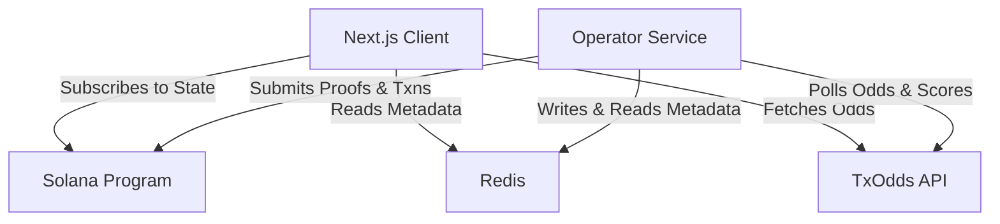

# Undegen Protocol

A high-performance, principal-protected sports prediction syndicate, voting consensus protocol, and web application built on **Solana**, **Anchor**, and **Next.js**.

> **Philosophy**: *Win together. Lose nothingl.*

---

## Executive Summary & Concept

Traditional sports betting offers exciting upside but comes with total risk of principal loss. While stablecoin staking eliminates principal loss, micro-yields are often too small to feel exciting and get fragmented across isolated bets.

**Undegen** solves this by combining **principal-protected staking**, **community consensus**, and **collective liquidity**:

1. **Zero Principal Risk**: Users deposit stablecoins into weekly prediction batches. Deposited principal remains 100% protected and is never placed at risk.
2. **Forecasted Yield Treasury**: At the start of each weekly batch, Undegen forecasts the expected staking yield. This forecasted yield becomes the protocol's collective betting budget.
3. **Community-Driven Syndicate**: Participants vote as a coordinated syndicate on upcoming sports fixtures (retrieved via TxOdds) to determine how the weekly yield budget is allocated.
4. **TXODDS Trustless Oracle Settlement**: Fixture outcomes and odds are verified on-chain using TXODDS cryptographic Merkle proofs, ensuring neither the backend nor any operator can tamper with results.
5. **Two Layers of Participation**:
   - **Cooperation Layer**: Collective consensus voting during weekly prediction batches.
   - **Optional Weekly Jackpot**: Post-settlement entertainment layer powered by Switchboard VRF, allowing users to voluntarily roll earned rewards (never principal) into a jackpot pool.

---

## Weekly Prediction Flow

```text
1. Deposit & Lock  -->  2. Batch Creation  -->  3. Market Discovery  -->  4. Community Voting
(Stablecoins locked)    (Forecast yield budget) (TxOdds fixture fetch)   (Vote Market or Skip)
                                                                                  │
7. Reward Payout   <--  6. Trustless Settle <--  5. Liquidity Alloc   <-----------┘
(Claim or Jackpot)     (On-chain Merkle proof) (Consume slot or Skip)
```

1. **Deposit & Lock**: Participants lock stablecoins for weekly batches while generating staking yield.
2. **Batch Creation**: Undegen estimates weekly yield to establish the available prediction budget.
3. **Market Discovery**: Operator & App fetch upcoming fixtures from TxOdds API for voting.
4. **Community Voting**: Participants vote for a high-odds market or choose **Skip** to preserve budget.
5. **Liquidity Allocation**: Winning markets consume 1 of the batch's limited allocation slots (e.g., max 5 accepted predictions per week). If **Skip** wins, liquidity is saved.
6. **Trustless Settlement**: Once matches finish, official results are verified on-chain via TXODDS cryptographic Merkle proofs (`settle_with_proof`).
7. **Reward Distribution & Jackpot**: Claim earned rewards immediately, or voluntarily enter the Switchboard VRF Weekly Jackpot with earned rewards.

---

## Subsystem Architecture Overview

The Undegen repository is organized into three specialized subsystems:

- **Operator Service (`operator/`)**: An off-chain Rust daemon built with Tokio. It is the sole writer to Redis, tracking active batch fixtures, querying TxOdds for market odds/scores, generating cryptographic Merkle proofs, and executing automated transactions on Solana.
- **Client Application (`app/`)**: A Next.js 16 + React 19 web application featuring Web3 wallet hooks, interactive Tailwind UI, Three.js visuals, on-chain Solana contract change subscriptions, read-only Redis metadata lookups, and TxOdds API proxy handlers.
- **Solana Anchor Programs (`programs/`)**: On-chain smart contracts written in Rust using Anchor (`v0.32.1`):
  - `undegen_core`: Core state machine, consensus, Merkle proof validation (`deposit_collateral`), and match settlement (`settle_with_proof`).
  - `lottery`: Switchboard VRF oracle integration for randomized claim lotteries (`claim_and_join_lottery`).
  - `yield_vault`: Vault reserve management and APY yield compounding.

For an architectural deep dive, see [Architecture & Design](./docs/architecture.md).

---

## System Integration Diagram



---

## Redis Role Breakdown

Redis serves a clear read vs. write dynamic:

- **Operator Service (`operator/`) [Writer & Reader]**: Writes active batch fixture metadata to Redis. Reads stored fixture IDs to query TxOdds for generating cryptographic Merkle proofs (`deposit_collateral`) and fetching final scores for match settlement proofs (`settle_with_proof`).
- **Frontend App (`app/`) [Read-Only]**: Performs read-only lookups from Redis to know the exact match metadata to query from the TxOdds API when rendering fixtures for participant voting in the UI.

---

## Quick Start & Local Setup

### Prerequisites

Ensure you have the following installed:

- **Rust** (latest stable, `1.89.0` compatible)
- **Solana CLI** (configured for `devnet` or `localnet`)
- **Anchor CLI** (`v0.32.1`)
- **mise** (Toolchain & task runner — see [mise.rs](https://mise.rs))
- **Docker & Docker Compose** (For local Redis container)

### Why We Use `mise`

We use [mise](https://mise.rs) to ensure a consistent, reproducible local development setup across machines. It automatically manages Node.js (`v20.19.0`) and pnpm (`v10.5.2`).

View all available tasks defined in `mise` by running:

```bash
mise tasks
```

---

## Local Setup Guide

### 1. Clone the repository

```bash
git clone <repo-url>
cd undegen
```

### 2. Install toolchains & dependencies via `mise`

```bash
# Install toolchains (Node.js & pnpm)
mise install

# Install frontend dependencies
mise run install
```

### 3. Configure environment variables

Configure your `.env` file inside the `app/` directory:

```bash
cp app/.env.example app/.env   # or edit app/.env directly
```

#### Environment Variables Example (`app/.env`)

```env
BEARER_TOKEN=                  # TxOdds API Bearer Token
API_TOKEN=                     # TxOdds API Token
NEXT_PUBLIC_OPERATOR_SECRET_KEY= # Solana Operator Private Key (bs58)
NEXT_PUBLIC_ALT_ADDRESS=       # Solana Alt Address Lookup Table
REDIS_URL=redis://localhost:6379 # Redis Connection String
```

---

## Local Development & Tasks

### 1. Docker Redis Infrastructure

```bash
# Start local Redis container
mise run redis

# Tail Redis container logs
mise run redis:logs

# Stop Redis container
mise run redis:down
```

---

### 2. Operator Service Tasks (`operator/`)

```bash
# Run the Undegen Operator daemon service
mise run operator:run

# Build the Operator service binary in release mode
mise run operator:build

# Run cargo check on the Operator codebase
mise run operator:check
```

---

### 3. Frontend Client Tasks (`app/`)

```bash
# Run Next.js dev server (http://localhost:3000)
mise run dev

# Install frontend dependencies
mise run install

# Run ESLint & code formatting checks
mise run lint
mise run format
mise run format:check

# Run CI verification (build, lint, format check)
mise run ci

# Build & run production server
mise run build
mise run start
```

---

### 4. Solana Anchor Program Tasks (`programs/`)

```bash
# Build Anchor Solana programs (lottery, undegen_core, yield_vault)
mise run anchor:build

# Run Rust unit and integration tests
mise run anchor:test
```

---

## Project Structure

```text
.
├── app/                  # Next.js frontend client & API service
│   ├── app/              # App Router pages and TxOdds proxy endpoints
│   ├── docker-compose.yml# Local Redis service configuration
│   └── package.json      # Frontend package dependencies
├── docs/                 # Technical documentation
│   ├── app_architecture.md
│   ├── app_getting_started.md
│   ├── architecture.md   # System architecture master index
│   ├── getting_started.md# Setup and user guide master index
│   ├── operator_architecture.md
│   ├── operator_getting_started.md
│   ├── programs_architecture.md
│   └── programs_getting_started.md
├── operator/             # Undegen Operator Rust service daemon
│   ├── config.yml        # Operator configuration settings
│   └── src/              # Operator main tick loop, Solana client, & processor
├── programs/             # Solana Anchor Smart Contracts
│   ├── lottery/          # Switchboard VRF lottery program
│   ├── undegen_core/     # Core protocol state, consensus, proofs, and settlement
│   └── yield_vault/      # Yield vault management program
├── concept.pdf           # Undegen platform concept & consensus model specification
├── Anchor.toml           # Anchor workspace configuration
├── Cargo.toml            # Rust workspace configuration
└── mise.toml             # Unified task runner configuration
```

---

## Documentation

Explore the `docs/` folder for comprehensive documentation across all sub-systems:

| Subsystem | Getting Started | Architecture & Design |
| :--- | :--- | :--- |
| **Master Overview** | **[Getting Started](./docs/getting_started.md)** | **[Architecture](./docs/architecture.md)** |
| **Operator Service** | **[Operator Setup](./docs/operator_getting_started.md)** | **[Operator Design](./docs/operator_architecture.md)** |
| **Client Application** | **[Client App Setup](./docs/app_getting_started.md)** | **[Client App Design](./docs/app_architecture.md)** |
| **Solana Programs** | **[Solana Programs Setup](./docs/programs_getting_started.md)** | **[Solana Programs Design](./docs/programs_architecture.md)** |
