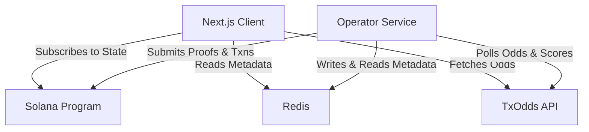

# Architecture & Design – Undegen Master Overview

**Undegen** is built on a modular three-tier architecture separating smart contract execution, off-chain operator orchestration, and client web interfaces.

The protocol transforms passive stablecoin staking into a community-managed prediction syndicate with zero principal risk, using TXODDS as a trustless sports oracle and Switchboard VRF for optional post-settlement lotteries.

---

## Protocol Lifecycle (Weekly Batch Flow)

```text
1. Deposit & Lock  -->  2. Batch Creation  -->  3. Market Discovery  -->  4. Community Voting
(Stablecoins locked)    (Forecast yield budget) (TxOdds fixture fetch)   (Vote Market or Skip)
                                                                                  │
7. Reward Payout   <--  6. Trustless Settle <--  5. Liquidity Alloc   <-----------┘
(Claim or Jackpot)     (On-chain Merkle proof) (Consume slot or Skip)
```

1. **Deposit & Lock**: Users deposit stablecoins for weekly batches to generate staking yield while preserving 100% of their principal.
2. **Weekly Batch Creation**: Forecasts expected staking yield for the batch, establishing the protocol's available prediction budget.
3. **Market Discovery**: Operator & Client App continuously retrieve upcoming sports fixtures and markets from TXODDS API.
4. **Community Voting**: Participants vote on eligible fixtures by selecting a high-odds market or **Skip** to save budget.
5. **Liquidity Allocation**: Winning markets consume 1 of the weekly batch's limited allocation slots (e.g., max 5 accepted predictions). If **Skip** wins, liquidity is preserved.
6. **Trustless Settlement**: Official match outcomes are verified on-chain using TXODDS Merkle proofs (`settle_with_proof`). Neither the backend nor any operator can alter results.
7. **Reward Distribution & Optional Jackpot**: Earned rewards are distributed proportionally. Participants can claim immediately or voluntarily roll earned rewards into the Switchboard VRF Weekly Jackpot.

---

## Component Architecture Guides

For detailed architectural deep dives into each layer, see:

| Subsystem | Folder | Architecture Guide | Technical Highlights |
| :--- | :--- | :--- | :--- |
| **Operator Service** | `operator/` | **[Operator Architecture](./operator_architecture.md)** | Rust Tokio daemon, state machine processor, Merkle proof generator, Redis state & fixture storage |
| **Client Application** | `app/` | **[Client App Architecture](./app_architecture.md)** | Next.js 16 App Router, Solana contract change subscriber, TxOdds API Proxy, read-only Redis lookups |
| **Solana Programs** | `programs/` | **[Solana Programs Architecture](./programs_architecture.md)** | `undegen_core`, `lottery` (Switchboard VRF), `yield_vault`, on-chain proof verification |

---

## System Integration Diagram


