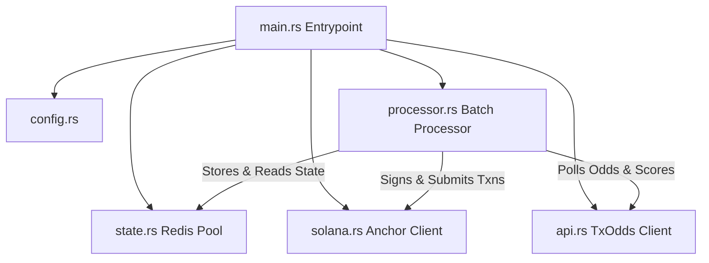

# Operator Service – Architecture & Design

The **Undegen Operator Service** (`operator/`) is an off-chain orchestration daemon written in Rust using Tokio async runtime. It bridges external sports data providers (TxOdds) with Solana on-chain smart contracts.

The Operator Service is the sole component responsible for writing and submitting batch fixture metadata to Redis.

---

## Component Architecture

---

## Crate Module Breakdown

### 1. Entrypoint & Execution Loop (`src/main.rs`)
- **Tokio Runtime**: Initializes a multi-threaded async runtime.
- **Tracing Subscriber**: Configures structured logging via `tracing-subscriber` (controllable via `RUST_LOG`).
- **Tick Interval Loop**: Schedules periodic ticks (default: every 5s) to invoke `BatchProcessor::tick()`.
- **Graceful Shutdown**: Intercepts `Ctrl+C` signals to stop processing cleanly.

### 2. Configuration (`src/config.rs`)
- Parses `config.yml` settings alongside environment variables (`app/.env`).
- Keypair loading: Derives the operator's Solana wallet keypair from `NEXT_PUBLIC_OPERATOR_SECRET_KEY` (base58).

### 3. Redis State & Fixture Submissions (`src/state.rs`)
The Operator Service acts as the sole writer to Redis:
- **Submitting Fixture Metadata**: Writes active batch fixture IDs and metadata to Redis so that both the operator and the client app know which specific matches to fetch from the TxOdds API.
- **Fixture Tracking for Proofs**: Reads stored fixture IDs from Redis to fetch TxOdds market odds and construct Merkle proofs for collateral deposits (`deposit_collateral`).
- **Score Proving & Settlement**: Submits completed fixture parameters to Redis to fetch game results from TxOdds and generate cryptographic score proofs during match settlement (`settle_with_proof`).
- **Batch State Management**: Caches active batch stages to avoid duplicate transaction submissions and prevent RPC rate-limiting.

### 4. Solana Client Engine (`src/solana.rs`)
- Wraps `anchor-client` and `solana-client`.
- Constructs, signs, and sends transactions for `initialize_batch`, `propose_match`, `finalize_consensus`, `deposit_collateral`, `settle_with_proof`, and `claim_operator_yield`.

### 5. Oracle API Client (`src/api.rs`)
- Communicates with TxOdds REST APIs (`https://txline-dev.txodds.com`).
- Fetches fixture snapshots, market odds, and final scores.
- Formats cryptographic payloads (`OddsBatchSummary`, `ScoresBatchSummary`, `ProofNode`) required by `undegen_core`.

### 6. Batch Processor Engine (`src/processor.rs`)
- Drives the state machine logic during every `tick()`.
- Evaluates on-chain batch states and executes required state transitions automatically.

---

## Operator State Machine Flow

1. **Lobby Phase**: Detects initialized batches with sufficient users; triggers `start_batch`.
2. **Proposal Phase**: Fetches upcoming fixtures from TxOdds API, writes fixture metadata to Redis, and submits `propose_match`.
3. **Consensus Phase**: Checks participant votes and submits `finalize_consensus`.
4. **Collateral Phase**: Reads fixture IDs from Redis, fetches market odds from TxOdds, constructs Merkle proofs, and calls `deposit_collateral`.
5. **Settlement Phase**: Monitors match completion via Redis & TxOdds, generates score proofs, and executes `settle_with_proof`.
6. **Yield Claim**: Claims operator yield fees (`claim_operator_yield`) upon batch completion.
