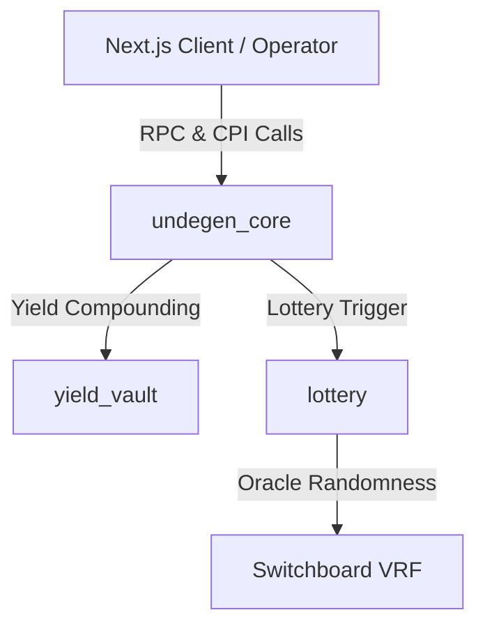

# Solana Programs – Architecture & Design

The **Undegen Solana Smart Contracts** (`programs/`) form the decentralized state machine and settlement layer of the protocol. Built using Anchor, the programs handle batch deposits, voting consensus, cryptographic oracle proof validation, match settlement, and VRF lotteries.

---

## Workspace Program Breakdown

### 1. `undegen_core` (`programs/undegen_core`)

The main protocol state machine and escrow engine.

#### Core Modules
- **`lib.rs`**: Entrypoint declaring instruction handlers.
- **`state.rs`**: Account structures (`Protocol`, `Batch`, `Proposal`, `VoteAccount`, `UserAccount`, `BetTerms`).
- **`txodds_types.rs`**: Structs for cryptographic validation (`Odds`, `OddsBatchSummary`, `ScoresBatchSummary`, `ProofNode`).
- **`instructions/`**:
  - `initialize_protocol.rs` & `initialize_batch.rs`: Set up global protocol parameters and batch pools.
  - `join_batch.rs` & `leave_batch.rs`: Escrow user deposits.
  - `start_batch.rs`: Lock batch deposits and begin proposal phase.
  - `propose_match.rs` & `cast_vote.rs` & `finalize_consensus.rs`: Propose fixtures, collect participant votes, and establish consensus.
  - `deposit_collateral.rs`: Verify TxOdds Merkle sub-tree and main-tree proofs on-chain and log collateral deposits.
  - `settle_with_proof.rs` & `settle_default.rs`: Settle matches using verified fixture scores or fallback default logic.
  - `claim.rs`, `claim_and_join_lottery.rs`, `claim_operator_yield.rs`: Distribute batch winnings, trigger lottery entries, and yield operator fees.

---

### 2. `lottery` (`programs/lottery`)

- **Switchboard Integration (`switchboard.rs`)**: Connects with Switchboard VRF feeds to ensure un-manipulable on-chain randomness for participant lotteries.
- Executes prize payouts to lucky winning claimers when `claim_and_join_lottery` is invoked.

---

### 3. `yield_vault` (`programs/yield_vault`)

- Manages yield reserves and SPL Token vaults.
- Generates and compounds protocol APY during batch lifecycles.

---

## On-Chain Cryptographic Merkle Verification

`undegen_core` implements custom Merkle proof verification directly in Rust:
1. **`deposit_collateral`**: Accepts `OddsBatchSummary`, `sub_tree_proof`, and `main_tree_proof`. It re-computes parent node hashes up to the main root to ensure odds data matches the trusted oracle state before accepting collateral.
2. **`settle_with_proof`**: Accepts `ScoresBatchSummary` and score proof nodes (`fixture_proof`, `main_tree_proof`) to verify final match scores before releasing funds.
